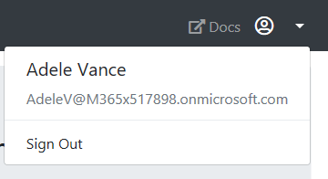

<!-- markdownlint-disable MD002 MD041 -->

在本练习中，你将扩展上一练习中的应用程序，以支持 Azure AD 的身份验证。 若要获取所需的 OAuth 访问令牌以调用 Microsoft Graph，这是必需的。 在此步骤中，将 [Microsoft 身份验证库](https://github.com/AzureAD/microsoft-authentication-library-for-js) 库集成到应用程序中。

1. 在名为的目录中创建一个新文件 `./src` `Config.ts` ，并添加以下代码。

    :::code language="typescript" source="../demo/graph-tutorial/src/Config.example.ts":::

    将替换 `YOUR_APP_ID_HERE` 为应用程序注册门户中的应用程序 ID。

    > [!IMPORTANT]
    > 如果您使用的是源代码管理（如 git），现在可以 `Config.ts` 从源代码管理中排除该文件，以避免无意中泄漏您的应用程序 ID。

## <a name="implement-sign-in"></a>实施登录

在本节中，您将创建一个身份验证提供程序，并实现登录和注销。

1. 在名为的目录中创建一个新文件 `./src` `AuthProvider.tsx` ，并添加以下代码。

    ```typescript
    import React from 'react';
    import { PublicClientApplication } from '@azure/msal-browser';

    import { config } from './Config';

    export interface AuthComponentProps {
      error: any;
      isAuthenticated: boolean;
      user: any;
      login: Function;
      logout: Function;
      getAccessToken: Function;
      setError: Function;
    }

    interface AuthProviderState {
      error: any;
      isAuthenticated: boolean;
      user: any;
    }

    export default function withAuthProvider<T extends React.Component<AuthComponentProps>>
      (WrappedComponent: new(props: AuthComponentProps, context?: any) => T): React.ComponentClass {
      return class extends React.Component<any, AuthProviderState> {
        private publicClientApplication: PublicClientApplication;

        constructor(props: any) {
          super(props);
          this.state = {
            error: null,
            isAuthenticated: false,
            user: {}
          };

          // Initialize the MSAL application object
          this.publicClientApplication = new PublicClientApplication({
            auth: {
                clientId: config.appId,
                redirectUri: config.redirectUri
            },
            cache: {
                cacheLocation: "sessionStorage",
                storeAuthStateInCookie: true
            }
          });
        }

        componentDidMount() {
          // If MSAL already has an account, the user
          // is already logged in
          const accounts = this.publicClientApplication.getAllAccounts();

          if (accounts && accounts.length > 0) {
            // Enhance user object with data from Graph
            this.getUserProfile();
          }
        }

        render() {
          return <WrappedComponent
            error = { this.state.error }
            isAuthenticated = { this.state.isAuthenticated }
            user = { this.state.user }
            login = { () => this.login() }
            logout = { () => this.logout() }
            getAccessToken = { (scopes: string[]) => this.getAccessToken(scopes)}
            setError = { (message: string, debug: string) => this.setErrorMessage(message, debug)}
            {...this.props} {...this.state} />;
        }

        async login() {
          try {
            // Login via popup
            await this.publicClientApplication.loginPopup(
                {
                  scopes: config.scopes,
                  prompt: "select_account"
              });

            // After login, get the user's profile
            await this.getUserProfile();
          }
          catch(err) {
            this.setState({
              isAuthenticated: false,
              user: {},
              error: this.normalizeError(err)
            });
          }
        }

        logout() {
          this.publicClientApplication.logout();
        }

        async getAccessToken(scopes: string[]): Promise<string> {
          try {
            const accounts = this.publicClientApplication
              .getAllAccounts();

            if (accounts.length <= 0) throw new Error('login_required');
            // Get the access token silently
            // If the cache contains a non-expired token, this function
            // will just return the cached token. Otherwise, it will
            // make a request to the Azure OAuth endpoint to get a token
            var silentResult = await this.publicClientApplication
                .acquireTokenSilent({
                  scopes: scopes,
                  account: accounts[0]
                });

            return silentResult.accessToken;
          } catch (err) {
            // If a silent request fails, it may be because the user needs
            // to login or grant consent to one or more of the requested scopes
            if (this.isInteractionRequired(err)) {
              var interactiveResult = await this.publicClientApplication
                  .acquireTokenPopup({
                    scopes: scopes
                  });

              return interactiveResult.accessToken;
            } else {
              throw err;
            }
          }
        }

        async getUserProfile() {
          try {
            var accessToken = await this.getAccessToken(config.scopes);

            if (accessToken) {
              // TEMPORARY: Display the token in the error flash
              this.setState({
                isAuthenticated: true,
                error: { message: "Access token:", debug: accessToken }
              });
            }
          }
          catch(err) {
            this.setState({
              isAuthenticated: false,
              user: {},
              error: this.normalizeError(err)
            });
          }
        }

        setErrorMessage(message: string, debug: string) {
          this.setState({
            error: {message: message, debug: debug}
          });
        }

        normalizeError(error: string | Error): any {
          var normalizedError = {};
          if (typeof(error) === 'string') {
            var errParts = error.split('|');
            normalizedError = errParts.length > 1 ?
              { message: errParts[1], debug: errParts[0] } :
              { message: error };
          } else {
            normalizedError = {
              message: error.message,
              debug: JSON.stringify(error)
            };
          }
          return normalizedError;
        }

        isInteractionRequired(error: Error): boolean {
          if (!error.message || error.message.length <= 0) {
            return false;
          }

          return (
            error.message.indexOf('consent_required') > -1 ||
            error.message.indexOf('interaction_required') > -1 ||
            error.message.indexOf('login_required') > -1 ||
            error.message.indexOf('no_account_in_silent_request') > -1
          );
        }
      }
    }
    ```

1. 打开 `./src/App.tsx` 并将以下 `import` 语句添加到文件顶部。

    ```typescript
    import withAuthProvider, { AuthComponentProps } from './AuthProvider';
    ```

1. 将行替换 `class App extends Component<any> {` 为以下代码行。

    ```typescript
    class App extends Component<AuthComponentProps> {
    ```

1. 将行替换 `export default App;` 为以下代码行。

    ```typescript
    export default withAuthProvider(App);
    ```

1. 保存所做的更改并刷新浏览器。 单击 "登录" 按钮，您应该会看到一个加载的弹出窗口 `https://login.microsoftonline.com` 。 使用你的 Microsoft 帐户登录，并同意请求的权限。 应用程序页面应刷新，并显示令牌。

### <a name="get-user-details"></a>获取用户详细信息

在本节中，你将从 Microsoft Graph 获取用户的详细信息。

1. 在目录中创建一个名为的新文件 `./src` `GraphService.ts` ，并添加以下代码。

    :::code language="typescript" source="../demo/graph-tutorial/src/GraphService.ts" id="graphServiceSnippet1":::

    这将实现 `getUserDetails` 使用 Microsoft GRAPH SDK 调用 `/me` 终结点并返回结果的函数。

1. 打开 `./src/AuthProvider.tsx` 并将以下 `import` 语句添加到文件顶部。

    ```typescript
    import { getUserDetails } from './GraphService';
    ```

1. 将现有的 `getUserProfile` 函数替换成以下代码。

    :::code language="typescript" source="../demo/graph-tutorial/src/AuthProvider.tsx" id="getUserProfileSnippet" highlight="6-18":::

1. 保存所做的更改并启动应用程序，登录后应返回到主页，但 UI 应更改以指示您已登录。

    

1. 单击右上角的用户头像以访问 " **注销** " 链接。 单击 " **注销** " 重置会话并返回到主页。

    

## <a name="storing-and-refreshing-tokens"></a>存储和刷新令牌

此时，您的应用程序具有访问令牌，该令牌是在 `Authorization` API 调用的标头中发送的。 这是允许应用代表用户访问 Microsoft Graph 的令牌。

但是，此令牌的生存期较短。 令牌在发出后会过期一小时。 这就是刷新令牌变得有用的地方。 刷新令牌允许应用在不要求用户重新登录的情况下请求新的访问令牌。

由于应用程序使用的是 MSAL 库，因此您无需实现任何令牌存储或刷新逻辑。 将在 `PublicClientApplication` 浏览器会话中缓存令牌。 该 `acquireTokenSilent` 方法首先检查缓存的标记，如果它未过期，它将返回。 如果它已过期，则使用缓存的刷新令牌获取新的。 您将在以下模块中更多地使用此方法。
