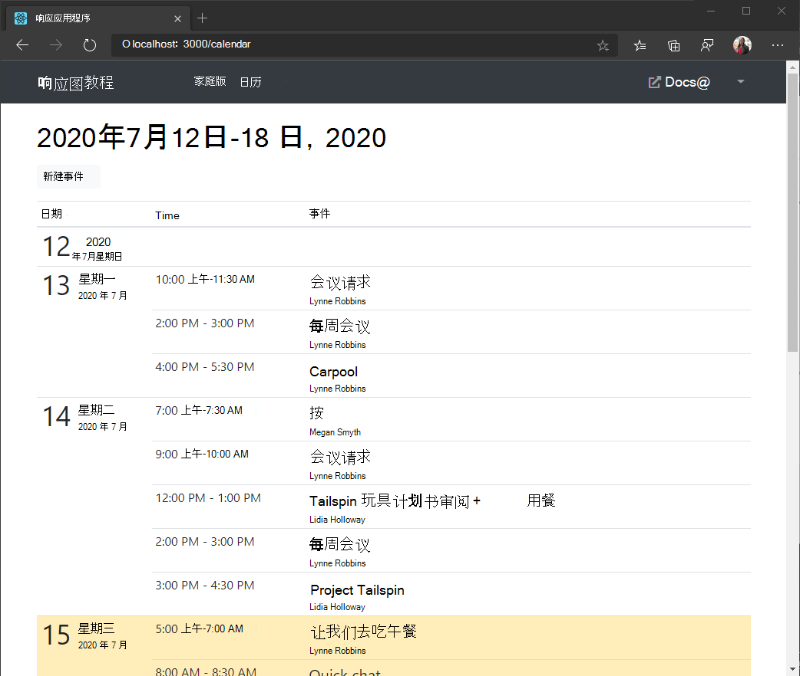

<!-- markdownlint-disable MD002 MD041 -->

在本练习中，将把 Microsoft Graph 合并到应用程序中。 对于此应用程序，您将使用 [microsoft graph 客户端](https://github.com/microsoftgraph/msgraph-sdk-javascript) 库调用 microsoft graph。

## <a name="get-calendar-events-from-outlook"></a>从 Outlook 获取日历事件

1. 打开 `./src/GraphService.ts` 并添加以下函数。

    :::code language="typescript" source="../demo/graph-tutorial/src/GraphService.ts" id="getUserWeekCalendarSnippet":::

    考虑此代码执行的操作。

    - 将调用的 URL 为 `/me/calendarview` 。
    - 该 `header` 方法将 `Prefer: outlook.timezone=""` 标头添加到请求，从而导致响应中的时间位于用户的首选时区中。
    - `query`方法添加 `startDateTime` 和 `endDateTime` 参数，定义日历视图的时间窗口。
    - 此 `select` 方法将为每个事件返回的字段限制为只是视图实际使用的字段。
    - `orderby`方法按其创建日期和时间对结果进行排序，最新项目最先开始。
    - 该 `top` 方法将结果限制为前50个事件。
    - 如果响应包含一个 `@odata.nextLink` 值，指示有更多的可用结果， `PageIterator` 则使用对象在集合中进行 [分页](https://docs.microsoft.com/graph/sdks/paging?tabs=typeScript) 以获取所有结果。

1. 创建响应组件以显示呼叫结果。 在名为的目录中创建一个新文件 `./src` `Calendar.tsx` ，并添加以下代码。

    ```typescript
    import React from 'react';
    import { NavLink as RouterNavLink } from 'react-router-dom';
    import { Table } from 'reactstrap';
    import moment from 'moment-timezone';
    import { findOneIana } from "windows-iana";
    import { Event } from 'microsoft-graph';
    import { config } from './Config';
    import { getUserWeekCalendar } from './GraphService';
    import withAuthProvider, { AuthComponentProps } from './AuthProvider';

    interface CalendarState {
      eventsLoaded: boolean;
      events: Event[];
      startOfWeek: Moment | undefined;
    }

    class Calendar extends React.Component<AuthComponentProps, CalendarState> {
      constructor(props: any) {
        super(props);

        this.state = {
          eventsLoaded: false,
          events: [],
          startOfWeek: undefined
        };
      }

      async componentDidUpdate() {
        try {
          // Get the user's access token
          var accessToken = await this.props.getAccessToken(config.scopes);
          // Convert user's Windows time zone ("Pacific Standard Time")
          // to IANA format ("America/Los_Angeles")
          // Moment needs IANA format
          var ianaTimeZone = findOneIana(this.props.user.timeZone);

          // Get midnight on the start of the current week in the user's timezone,
          // but in UTC. For example, for Pacific Standard Time, the time value would be
          // 07:00:00Z
          var startOfWeek = moment.tz(ianaTimeZone!.valueOf()).startOf('week').utc();

          // Get the user's events
          var events = await getUserWeekCalendar(accessToken, this.props.user.timeZone, startOfWeek);

          // Update the array of events in state
          this.setState({
            eventsLoaded: true,
            events: events,
            startOfWeek: startOfWeek
          });
        }
        catch(err) {
          this.props.setError('ERROR', JSON.stringify(err));
        }
      }

      render() {
        return (
          <pre><code>{JSON.stringify(this.state.events, null, 2)}</code></pre>
        );
      }
    }

    export default withAuthProvider(Calendar);
    ```

    现在，这只是在页面上呈现 JSON 中的事件数组。

1. 将此新组件添加到应用程序中。 打开 `./src/App.tsx` 并将以下 `import` 语句添加到文件顶部。

    ```typescript
    import Calendar from './Calendar';
    ```

1. 将以下组件添加到现有的后面 `<Route>` 。

    ```typescript
    <Route exact path="/calendar"
      render={(props) =>
        this.props.isAuthenticated ?
          <Calendar {...props} /> :
          <Redirect to="/" />
      } />
    ```

1. 保存更改并重新启动该应用。 登录并单击导航栏中的 " **日历** " 链接。 如果一切正常，应在用户的日历上看到一个 JSON 转储的事件。

## <a name="display-the-results"></a>显示结果

现在，您可以更新 `Calendar` 组件以以更用户友好的方式显示事件。

1. 在名为的目录中创建一个新文件 `./src` `Calendar.css` ，并添加以下代码。

    :::code language="css" source="../demo/graph-tutorial/src/Calendar.css":::

1. 创建一个响应组件以在一个天内以表行的形式呈现事件。 在名为的目录中创建一个新文件 `./src` `CalendarDayRow.tsx` ，并添加以下代码。

    :::code language="typescript" source="../demo/graph-tutorial/src/CalendarDayRow.tsx" id="CalendarDayRowSnippet":::

1. 将以下 `import` 语句添加到 " **tsx**" 顶部。

    ```typescript
    import CalendarDayRow from './CalendarDayRow';
    import './Calendar.css';
    ```

1. 将中的现有 `render` 函数替换 `./src/Calendar.tsx` 为以下函数。

    :::code language="typescript" source="../demo/graph-tutorial/src/Calendar.tsx" id="renderSnippet":::

    这会将事件拆分为各自的天，并为每天呈现一个表节。

1. 保存所做的更改，然后重新启动应用程序。 单击 " **日历** " 链接，应用现在应呈现一个事件表。

    
