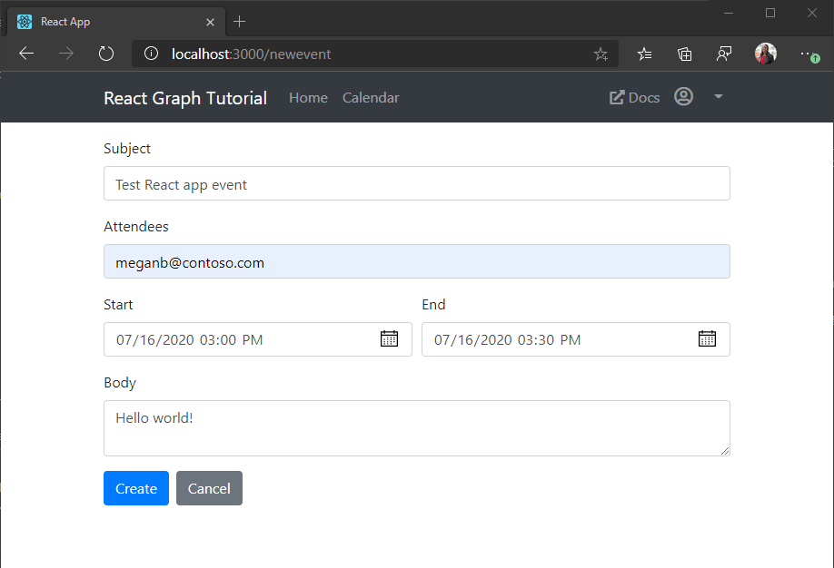

<!-- markdownlint-disable MD002 MD041 -->

在本节中，您将添加在用户日历上创建事件的功能。

## <a name="add-method-to-graphservice"></a>向 GraphService 添加方法

1. 打开 **/src/GraphService.ts** ，并添加以下函数以创建新事件。

    :::code language="typescript" source="../demo/graph-tutorial/src/GraphService.ts" id="createEventSnippet":::

## <a name="create-new-event-form"></a>创建新的事件表单

1. 在名为**NewEvent**的 **/src**目录中创建一个新文件，并添加以下代码。

    :::code language="typescript" source="../demo/graph-tutorial/src/NewEvent.tsx" id="NewEventSnippet":::

1. 打开 **/src/App.tsx** ，并将以下 `import` 语句添加到文件顶部。

    ```typescript
    import NewEvent from './NewEvent';
    ```

1. 将新的路由添加到新的事件表单。 紧接着将以下代码添加到其他 `Route` 元素之后。

    ```typescript
    <Route exact path="/newevent"
      render={(props) =>
        this.props.isAuthenticated ?
          <NewEvent {...props} /> :
          <Redirect to="/" />
      } />
    ```

    完整的 `return` 语句现在应如下所示。

    :::code language="typescript" source="../demo/graph-tutorial/src/App.tsx" id="renderSnippet" highlight="23-28":::

1. 刷新应用程序并浏览到 "日历" 视图。 单击 " **新建事件** " 按钮。 填写这些字段，然后单击 " **创建**"。

    
